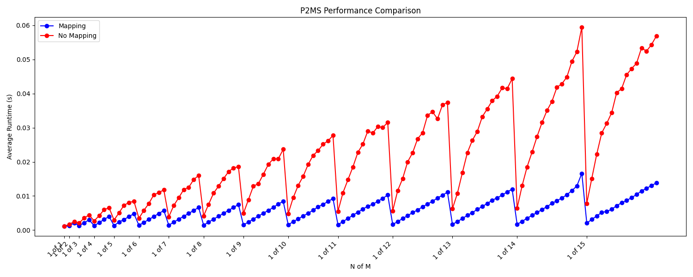

# Bitcoin-Script-Runtime
Implementation of the BTC script runtime in Python for CS 263, Winter '24

Bitcoin was the first practical implementation of a purely electronic payment system. Bitcoin invented the UTXO (unspent transaction output) model to counter double spending and support divisibility of coins. Each transaction takes in UTXO(s) as input(s) to fund the transaction and creates 1 or more UTXO(s) as output(s) that represent new coins. Once a transaction is mined, the UTXO(s) used as input are marked as spent so they can’t be reused and the output UTXO(s) are spendable in future transactions. UTXOs have 2 key components: amount and scriptPubKey. The amount is the value held by the UTXO in Satoshis (1​​ Satoshi = 10<sup>-8</sup> Bitcoin) and the scriptPubKey (locking script) is a program consisting of opcodes and operands which authenticate the owner of a UTXO. In order to spend a UTXO, a user must provide a valid input script (scriptSig). When combined with the UTXO’s scriptPubKey, if the resulting script successfully executes (top of the stack contains a truthy value) in the Bitcoin runtime for each UTXO input, the UTXOs can be spent. The Bitcoin runtime is a stack-based execution environment that supports quite complex—but not Turing complete—smart contracts.

Our project outcome is meant to be twofold. First, we will implement an approximation of the Bitcoin script runtime in Python to develop a deep understanding of the opcodes, stack machine, and capabilities of contracts. Second, we will attempt to turn an ostensible bug in the Bitcoin core implementation into a feature which will speed up execution of scripts containing the `OP_CHECKMULTISIG` opcode. Current Bitcoin scripts that use the `OP_CHECKMULTISIG` opcode require the input script to contain a dummy stack element which has no effect on the execution of the script. This is believed to be a bug in the Bitcoin core implementation and has existed since its inception. Because this opcode must check signature(s) against multiple public keys, we intend to utilize the dummy stack entry to specify a map of signatures and public keys to speed up execution of the `OP_CHECKMULTISIG` opcode. 

**Note:** Vanilla BTC scripts support n of 3, P2SH support n of 15, and P2TR support n of 20 multisig contracts.

---

## Performance Results for OP_CHECKMULTISIG



---

## Prerequisites

Before you begin, ensure you have met the following requirements:

- PyPy 3.x installed on your system.
- Basic knowledge of Python virtual environments.

## Setting Up a Virtual Environment

Follow these steps to set up a virtual environment for the project. A virtual environment is a self-contained directory that contains a Python installation for a particular version of Python, plus a number of additional packages.

### Creating the Virtual Environment

1. Open your terminal.
2. Navigate to the project directory:

    ```sh
    cd /path/to/your/project
    ```

3. Create a virtual environment using PyPy. Replace `myvenv` with the name of your virtual environment:

    ```sh
    pypy3 -m venv myvenv
    ```

    This command creates a new directory `myvenv` in your project directory, containing the virtual environment.

### Activating the Virtual Environment

Before you can start installing packages or running Python code, you need to activate the virtual environment. Activation adjusts your `PATH` so that the PyPy interpreter and scripts in the virtual environment are used by default.

- **On macOS and Linux:**

    ```sh
    source myvenv/bin/activate
    ```

    Your shell prompt will change to show the name of the activated environment.

### Installing Dependencies

With the virtual environment activated, you can now install project dependencies using `pip`:

```sh
pip install -r requirements.txt
```

### Running the Project

```sh
pypy3 main.py <YOUR SCRIPT FILE>
```

### Deactivating the Virtual Environment

When you're done working on the project, you can deactivate the virtual environment to revert to your global Python environment:

```sh
deactivate
```
